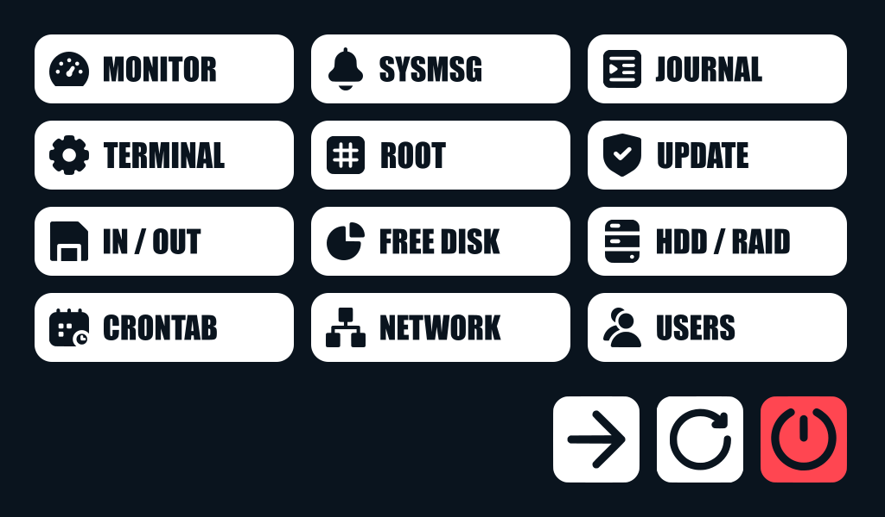

# ServerDesk

**ServerDesk** is a lightweight, framebuffer-based touchscreen menu for Linux servers – purpose-built for direct control and monitoring without the need for a graphical desktop environment.

Designed for environments with direct physical access, **ServerDesk** provides quick access to essential system commands such as process monitoring, log inspection, shutdown/reboot actions, and more – all through a clean, responsive overlay interface operated via touch input.



## Key Features

- **Framebuffer rendering** – no X11, Wayland or window manager required
- **Touchscreen-friendly UI** – designed for small screens (e.g., 1024×600)
- **Command-driven logic** – easily extensible via a simple JSON configuration
- **Secure and local** – no remote access, no internet exposure
- **Failsafe execution** – subprocesses run in isolated sessions, auto-recovery supported
- **Modular structure** – clean separation of scripts, assets and logic

**ServerDesk** is ideal for embedded or dedicated maintenance terminals, homelab servers, or rack-mounted systems with integrated display hardware.

## Requirements

### Hardware

- Linux-capable device with framebuffer support (e.g. `/dev/fb0`)
- Touchscreen input device (e.g. `/dev/input/eventX`)

### Software

- Any Linux distribution with:
  - Python 3.10+
  - Systemd
  - Framebuffer device enabled (no X11 or Wayland needed)
  - Write access to `/dev/fb0` and `/dev/input/eventX`
- Some packages to run **ServerDesk** commands:
  - `htop`, `iftop` and `iotop`: monitoring tools
  - `lm-sensors`: hardware monitoring
- Python packages: `evdev` and `Pillow`

You can install them via:

```bash
sudo apt install \
  htop iftop iotop lm-sensors \
  python3 python3-evdev python3-pillow
```

## Installation

### Step 1 — Create User

It is recommended to run **ServerDesk** under a dedicated system user. This enhances separation and allows fine-tuned sudo permissions. Name this user whatever you want, but bear in mind to change all the commands listed below to match your choice.

Here, the username `watchdog` will be used:

```bash
# Create the user account
sudo useradd -r -m -d /home/watchdog -s /usr/sbin/nologin watchdog

# Grant the user necessary rights (framebuffer and tty)
sudo usermod -aG video,tty watchdog

# You may check those with
groups watchdog
```

To allow **ServerDesk** to run commands without password prompts, edit the sudoers file:

```bash
sudo nano /etc/sudoers.d/serverdesk
```

And add the list of commands needet to run **ServerDesk**:

```bash
watchdog ALL=(ALL) NOPASSWD: \
  /usr/bin/apt, \
  /usr/bin/apt-get, \
  /usr/bin/chvt, \
  /usr/bin/df, \
  /usr/bin/dmesg, \
  /usr/bin/dpkg, \
  /usr/bin/htop, \
  /usr/bin/journalctl, \
  /usr/bin/systemctl, \
  /usr/bin/w, \
  /usr/sbin/iftop, \
  /usr/sbin/iotop, \
  /usr/sbin/mdadm
```

### Step 2 — Cloning Repository

Clone the **ServerDesk** repository to the appropriate location:

```bash
git clone https://github.com/komed3/serverdesk /home/watchdog/serverdesk
```

You can clone this repository with any user, but ownership must be transferred to your designated service user afterward, so the service can run the program without disruptions.

```bash
sudo chown -R watchdog:watchdog /home/watchdog/serverdesk
```

If the program, parts of it or individual commands cannot be executed, the following may help:

```bash
# Convert shell scripts to Unix format
sudo apt install dos2unix
find /home/watchdog/serverdesk/bin -type f -name "*.sh" -exec dos2unix {} +

# Ensure that all shell scripts are executable
sudo chmod +x /home/watchdog/serverdesk/bin/*.sh
sudo chmod +x /home/watchdog/serverdesk/menu.py
```

**ServerDesk** will automatically update itself via the service. If you do not want this behavior, add an exception for the directory so that any other user can upgrade it via `git pull`.

```bash
git config --global --add safe.directory /home/watchdog/serverdesk
```

Once the repository has been cloned and all its dependencies installed, the program can be tested locally:

```bash
sudo -u watchdog /home/watchdog/serverdesk/menu.py
```

### Step 3 — Set Up systemd Service

To ensure **ServerDesk** starts automatically on boot and controls the primary console (`tty1`), create a custom systemd service file:

```bash
sudo nano /etc/systemd/system/serverdesk.service
```

And put those lines there:

```bash
[Unit]
Description=ServerDesk
After=multi-user.target
Wants=graphical.target
ConditionPathExists=/home/watchdog/serverdesk/menu.py
Conflicts=getty@tty1.service

[Service]
Type=simple
User=watchdog
Group=tty
WorkingDirectory=/home/watchdog/serverdesk
ExecStartPre=/usr/bin/git -C /home/watchdog/serverdesk pull --quiet
ExecStart=/usr/bin/python3 /home/watchdog/serverdesk/menu.py
StandardInput=tty
StandardOutput=tty
StandardError=journal
Restart=always
RestartSec=2
TTYPath=/dev/tty1
TTYReset=yes
TTYVHangup=yes
RemainAfterExit=no

[Install]
WantedBy=multi-user.target
```

The `serverdesk.service` is tailored to run **ServerDesk** directly on virtual terminal `tty1`, ensuring smooth startup and reliable behavior:

- `User=watchdog` runs the process under a restricted service user without login privileges, improving security and preventing unintended interactions.
- `Group=tty` ensures access to `/dev/tty1`, which is required to read and write to the console framebuffer and control terminal sessions.
- `WorkingDirectory=/home/watchdog/serverdesk` sets the base path for relative commands and asset resolution.
- `ExecStartPre=...git pull` optionally updates the local repository before launch, allowing for unattended upgrades if no modifications are made.
- `ExecStart=...menu.py` is the main Python script that launches the **ServerDesk** menu overlay.
- `StandardInput/Output=tty` binds the service explicitly to the virtual console, enabling full interaction via touch and system commands.
- `TTYPath=/dev/tty1` defines the target terminal device for this service; this line ensures all in- and output is tied to the correct display.
- `Restart=always` and `RestartSec=2` provide resilience: if **ServerDesk** crashes or exits unexpectedly, it will be restarted automatically after a short delay.
- `Conflicts=getty@tty1.service` disables the standard login prompt on `tty1`, avoiding interference with **ServerDesk**'s console usage.
- `ConditionPathExists=...menu.py` ensures the service won't start unless the main script is present — useful as a safety check during setup or updates.

You may need to adjust some of them, especially if a different user name has been chosen or the files are located in a separate directory.

----

To prevent login prompts from interfering with **ServerDesk**, disable the default getty on `tty1`:

```bash
sudo systemctl disable getty@tty1.service
```

Reload systemd and activate the new service:

```bash
sudo systemctl daemon-reexec
sudo systemctl daemon-reload
sudo systemctl enable serverdesk.service
sudo systemctl start serverdesk.service
```

Now reboot the system to complete the setup:

```bash
sudo reboot
```

After rebooting the machine, the **ServerDesk** service should start and run its standard command (`htop`). When interacting with the touch screen, the overlay appears, allowing the user to execute further commands. System buttons on the bottom edge will allow to switch to TTY3 to log in, reboot the system, and shut it down completely.

> [!WARNING]
> **Important Note on Access**
>
> Once **ServerDesk** is active on `tty1`, the system will no longer provide a login prompt on that terminal.
>
> Ensure SSH access is available before proceeding — especially on headless systems.
>
> Alternatively, you can use `Ctrl + Alt + F2` (or F3–F6) to switch to another virtual terminal and log in there.
