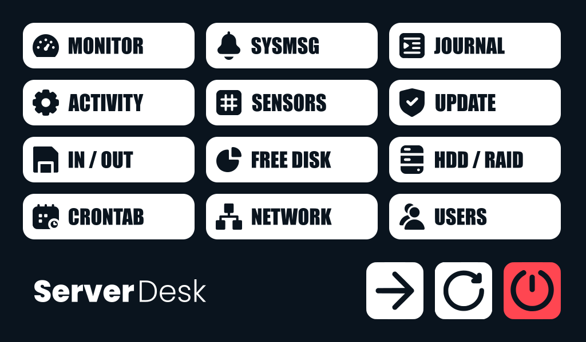

# ServerDesk

**ServerDesk** is a lightweight, framebuffer-based touchscreen menu for Linux servers – purpose-built for direct control and monitoring without the need for a graphical desktop environment.

Designed for environments with direct physical access, ServerDesk provides quick access to essential system commands such as process monitoring, log inspection, shutdown/reboot actions, and more – all through a clean, responsive overlay interface operated via touch input.

## Key Features

- **Framebuffer rendering** – no X11, Wayland or window manager required
- **Touchscreen-friendly UI** – designed for small screens (e.g., 1024×600)
- **Command-driven logic** – easily extensible via a simple JSON configuration
- **Secure and local** – no remote access, no internet exposure
- **Failsafe execution** – subprocesses run in isolated sessions, auto-recovery supported
- **Modular structure** – clean separation of scripts, assets and logic

ServerDesk is ideal for embedded or dedicated maintenance terminals, homelab servers, or rack-mounted systems with integrated display hardware.
